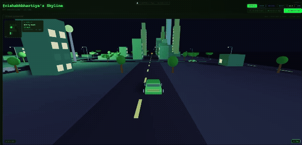

<div align="center">


<a href="https://gitcity.natrajx.in">
  
</a>

<br/>

[](https://gitcity.natrajx.in)
[](https://natrajx.in)
[](https://ko-fi.com/rishabhbhartiya)

</div>

<p align="center">
  
</p>

Drop this into any GitHub README, portfolio, or blog post:

```markdown
[](https://gitcity.natrajx.in/YOUR_USERNAME)
```

<p align="center">
  
</p>

<p align="center">
  <a href="https://gitcity.natrajx.in/rishabhbhartiya">
    
  </a>
</p>

---

## ✨ What is GitCity?

GitCity fetches your **entire GitHub contribution history** via the GitHub GraphQL API and renders it as:

<p align="center">
  
  
  
</p>

No personal access token required. Enter your username and go.

<a href="https://gitcity.natrajx.in">
  
</a>

---

## 🎨 Themes

Six handcrafted themes — switch instantly:

| Theme | Preview |
|-------|---------|
| **Matrix** | [](https://gitcity.natrajx.in/rishabhbhartiya?theme=matrix) |
| **Noir** | [](https://gitcity.natrajx.in/rishabhbhartiya?theme=noir) |
| **Aurora** | [](https://gitcity.natrajx.in/rishabhbhartiya?theme=aurora) |
| **Ocean** | [](https://gitcity.natrajx.in/rishabhbhartiya?theme=ocean) |
| **Gold** | [](https://gitcity.natrajx.in/rishabhbhartiya?theme=gold) |
| **Ice** | [](https://gitcity.natrajx.in/rishabhbhartiya?theme=ice) |

---

## 🔗 Embed API

The SVG embed API is **dynamic** — it re-renders from live GitHub data on each request.

### Basic embed

```markdown

```

### With theme

```markdown

```

Available themes: `matrix` · `noir` · `aurora` · `ocean` · `gold` · `ice`

### HTML (full control)

```html
<a href="https://gitcity.natrajx.in/YOUR_USERNAME">
  
</a>
```

### iframe (interactive, for portfolios)

```html
<iframe
  src="https://gitcity.natrajx.in/YOUR_USERNAME"
  width="100%" height="500"
  frameborder="0"
  title="GitHub Contribution Skyline">
</iframe>
```

---

## 🚀 Quick Start

### Option A — Use the hosted version (recommended)

Just go to **[gitcity.natrajx.in/YOUR_USERNAME](https://gitcity.natrajx.in)** — no setup needed.

### Option B — Self-host

```bash
# 1. Clone
git clone https://github.com/natrajx/gitcity
cd gitcity

# 2. Install
npm install

# 3. Set your GitHub token (for API calls)
echo "GITHUB_TOKEN=ghp_your_token_here" > .env.local

# 4. Run locally
vercel dev          # uses /api serverless functions
# OR
npm run dev         # Vite only (no API — use hosted API instead)

# 5. Deploy to Vercel
vercel --prod
```

### Environment variables

| Variable | Required | Description |
|----------|----------|-------------|
| `GITHUB_TOKEN` | Yes | GitHub Personal Access Token (read:user scope) |


---

## 🤖 SEO & AI Optimisation

Three files live in `public/` and are served directly from the site root:

| File | URL | Purpose |
|------|-----|---------|
| `public/robots.txt` | `/robots.txt` | Search crawler rules, AI bot allowlist, sitemap pointer |
| `public/sitemap.xml` | `/sitemap.xml` | Pages for Google to index |
| `public/llms.txt` | `/llms.txt` | Machine-readable summary for AI assistants (ChatGPT, Claude, Perplexity) |

**Why `public/`?** Vite copies everything in `public/` verbatim into `dist/` at build time, so these files are served at the bare URL with no routing involved — exactly what crawlers and search engines expect.

---

## 📁 Project Structure

```
gitcity/
├── public/                           # ← Static files served at site root
│   ├── robots.txt                    #   gitcity.natrajx.in/robots.txt
│   ├── sitemap.xml                   #   gitcity.natrajx.in/sitemap.xml
│   └── llms.txt                      #   gitcity.natrajx.in/llms.txt
├── api/
│   ├── contributions/[username].js   # Serverless: GitHub GraphQL proxy
│   └── og/[username].js              # Serverless: SVG generator for embeds
├── index.html                        # Root HTML with SEO/OG meta
├── src/
│   ├── App.jsx                       # Auth flow, URL params
│   ├── components/ContributionGraph3D/
│   │   ├── ContributionGraph3D.jsx   # Main graph component + filters
│   │   ├── IsometricGrid.jsx         # SVG isometric 3D skyline
│   │   ├── CitySimulation.jsx        # Three.js driveable city
│   │   ├── BirdsEyeGrid.jsx          # Heatmap view
│   │   └── Building.jsx              # Individual isometric building
│   ├── constants/
│   │   └── themes.js                 # 6 colour themes
│   └── hooks/
│       └── useGitHubData.js          # Data fetching hook
├── vercel.json                       # Routing rules
└── vite.config.js
```

---

## 🛠️ Tech Stack

- **[React 18](https://react.dev)** — UI
- **[Vite 5](https://vitejs.dev)** — build
- **[Three.js r128](https://threejs.org)** — city simulation (WebGL)
- **SVG** — isometric skyline (pure, embeddable)
- **[GitHub GraphQL API](https://docs.github.com/en/graphql)** — contribution data
- **[Vercel](https://vercel.com)** — hosting + serverless

---

## 🤝 Contributing

PRs welcome. Open an issue first for major changes.

```bash
git checkout -b feat/your-feature
# make changes
git commit -m "feat: your feature"
git push origin feat/your-feature
# open PR → main
```

---

## ☕ Support

GitCity is free and open-source — no login, no paywall, no token required.

If it made your README cooler or your portfolio stand out, consider buying me a coffee. It goes directly toward hosting costs, GPU time for experiments, and building more free tools like this one.

<a href="https://ko-fi.com/rishabhbhartiya">
  
</a>

---

## 🙋 About the Author

Built by **[Rishabh Bhartiya](https://rishabhbhartiya.natrajx.in)** — ML Engineer & full-stack developer. 3 years turning research-grade ideas into production systems at scale.

- 🌐 Portfolio: **[rishabhbhartiya.natrajx.in](https://rishabhbhartiya.natrajx.in)**
- 💼 Projects: [rishabhbhartiya.natrajx.in/projects](https://rishabhbhartiya.natrajx.in/projects)
- ✍️ Writing: [rishabhbhartiya.natrajx.in/blog](https://rishabhbhartiya.natrajx.in/blog)
- 🐙 GitHub: [@rishabhbhartiya](https://github.com/rishabhbhartiya)
- ☕ Ko-fi: [ko-fi.com/rishabhbhartiya](https://ko-fi.com/rishabhbhartiya)

If GitCity is useful to you, a ⭐ on the repo and a mention helps a lot.

---

## ❓ FAQ

**Is this the same as thegitcity.com?**  
No — completely different. See [COMPARISON.md](./COMPARISON.md) for the full breakdown.

---

## 📄 License

MIT © [Rishabh Bhartiya](https://rishabhbhartiya.natrajx.in) — free to use, modify, and distribute.

---

<div align="center">

Made with ☕ by <a href="https://rishabhbhartiya.natrajx.in"><strong>Rishabh Bhartiya</strong></a>
&nbsp;·&nbsp;
<a href="https://gitcity.natrajx.in">gitcity.natrajx.in</a>
&nbsp;·&nbsp;
<a href="https://rishabhbhartiya.natrajx.in/projects">More projects</a>
&nbsp;·&nbsp;
<a href="https://rishabhbhartiya.natrajx.in/blog">Blog</a>
&nbsp;·&nbsp;
<a href="https://ko-fi.com/rishabhbhartiya">☕ Ko-fi</a>

</div>
