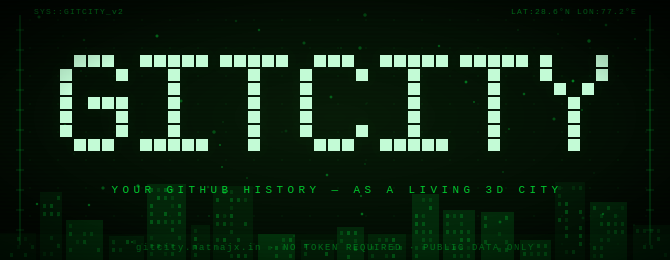

<div align="center">



<br/><br/>

<a href="https://gitcity.natrajx.in">
  
</a>

<br/>

[](https://gitcity.natrajx.in)
[](https://natrajx.in)
[](https://ko-fi.com/rishabhbhartiya)

</div>

---

## Instant Preview — No Login Needed

Share anyone's city directly. Three views, one link:

```
https://gitcity.natrajx.in/{username}/isometric     <-  3D skyline
https://gitcity.natrajx.in/{username}/heatmap        <-  bird's eye view
https://gitcity.natrajx.in/{username}/simulation     <-  driveable city
```

| Username | Isometric | Heatmap | Simulation |
|----------|-----------|---------|------------|
| **@gaearon** | [skyline](https://gitcity.natrajx.in/gaearon/isometric) | [heatmap](https://gitcity.natrajx.in/gaearon/heatmap) | [drive](https://gitcity.natrajx.in/gaearon/simulation) |
| **@torvalds** | [skyline](https://gitcity.natrajx.in/torvalds/isometric) | [heatmap](https://gitcity.natrajx.in/torvalds/heatmap) | [drive](https://gitcity.natrajx.in/torvalds/simulation) |
| **@sindresorhus** | [skyline](https://gitcity.natrajx.in/sindresorhus/isometric) | [heatmap](https://gitcity.natrajx.in/sindresorhus/heatmap) | [drive](https://gitcity.natrajx.in/sindresorhus/simulation) |

---

## Three Views of Your City

<p align="center">
  
</p>

<p align="center">
  
</p>

```
  ISOMETRIC                  HEATMAP                  SIMULATION
  3D skyline built           Bird's-eye grid of       Driveable city powered
  from your commit           contribution density.    by Three.js. Your
  streaks. Taller =          Spot your hottest        commits become
  more commits.              coding months.           real streets.
```

---

## Simulation Mode — Crash Physics

The city simulation isn't just a drive-around. It has consequences.

```
  CRASH DETECTION
  When your vehicle collides with a building or another object,
  an explosion triggers at the impact zone.

  SPEED-RESTRICTED ZONES
  The crash site becomes a permanent hazard zone.
  You cannot exceed 15 km/h within the blast radius.
  Zone markers appear on the minimap.

  EXPLOSION RESIDUE
  Charred geometry stays on the road.
  Drive through it and your handling degrades temporarily.

  ZONE STACKING
  Multiple crashes create overlapping restriction zones.
  Reckless driving turns your city into a no-go labyrinth.
```

> Your commit history literally shapes how dangerous your city is to drive through.

---

## What is GitCity?

GitCity fetches your **entire GitHub contribution history** via the GitHub GraphQL API and renders it as an interactive 3D city — no token required, no login, no paywall.

<p align="center">
  
  
  
</p>

---

## Themes

Six handcrafted themes — switch instantly via URL param:

| Theme | Preview | Direct Link |
|-------|---------|-------------|
| **Matrix** |  | `?theme=matrix` |
| **Noir** |  | `?theme=noir` |
| **Aurora** |  | `?theme=aurora` |
| **Ocean** |  | `?theme=ocean` |
| **Gold** |  | `?theme=gold` |
| **Ice** |  | `?theme=ice` |

```
https://gitcity.natrajx.in/torvalds/isometric?theme=matrix
https://gitcity.natrajx.in/gaearon/simulation?theme=noir
```

---

## Embed API

Drop a live, always-updated skyline anywhere — README, portfolio, blog post.

<p align="center">
  
</p>

```markdown
[](https://gitcity.natrajx.in/YOUR_USERNAME)
```

**With theme**

```markdown

```

Available: `matrix` · `noir` · `aurora` · `ocean` · `gold` · `ice`

**HTML — full control**

```html
<a href="https://gitcity.natrajx.in/YOUR_USERNAME">
  
</a>
```

**iframe — interactive, for portfolios**

```html
<iframe
  src="https://gitcity.natrajx.in/YOUR_USERNAME/isometric"
  width="100%" height="500"
  frameborder="0"
  title="GitHub Contribution Skyline">
</iframe>
```

---

## Quick Start

**Option A — Hosted (recommended)**

```
https://gitcity.natrajx.in/YOUR_USERNAME
```

No setup. No token. No account.

**Option B — Self-host**

```bash
# 1. Clone
git clone https://github.com/natrajx/gitcity
cd gitcity

# 2. Install
npm install

# 3. Set your GitHub token
echo "GITHUB_TOKEN=ghp_your_token_here" > .env.local

# 4. Run locally
vercel dev          # with /api serverless functions
# OR
npm run dev         # Vite only (uses hosted API)

# 5. Deploy
vercel --prod
```

**Environment variables**

| Variable | Required | Description |
|----------|----------|-------------|
| `GITHUB_TOKEN` | Yes | GitHub PAT with `read:user` scope |

---

## SEO & AI Optimisation

Three files in `public/` are served directly from the site root:

| File | URL | Purpose |
|------|-----|---------|
| `robots.txt` | `/robots.txt` | Crawler rules, AI bot allowlist, sitemap pointer |
| `sitemap.xml` | `/sitemap.xml` | Pages for Google to index |
| `llms.txt` | `/llms.txt` | Machine-readable summary for ChatGPT, Claude, Perplexity |

---

## Project Structure

```
GitCity/
├── api/
│   ├── contributions/
│   │   └── [username].js          # GitHub GraphQL proxy
│   ├── og/
│   │   └── [username].js          # OG image generator
│   └── svg.js                     # SVG embed endpoint
├── public/
│   ├── blast.mp3                  # Explosion sound
│   ├── crash.mp3                  # Crash sound
│   ├── music.mp3                  # Ambient city music
│   ├── rain.mp3                   # Weather ambience
│   ├── wind.mp3                   # Weather ambience
│   ├── comparison.html            # gitcity.natrajx.in/comparison
│   ├── story.html                 # gitcity.natrajx.in/story
│   ├── llms.txt
│   ├── robots.txt
│   ├── sitemap.xml
│   └── screenshots/
│       ├── banner.png
│       └── twitter-banner.png
├── screenshots/
│   ├── birdeye.gif
│   ├── cardriving.gif
│   ├── gitcity.svg                # Banner SVG (used in README)
│   ├── isometric.gif
│   └── login.gif
├── src/
│   ├── App.jsx                    # Auth flow, URL params, view routing
│   ├── main.jsx
│   ├── components/
│   │   └── ContributionGraph3D/
│   │       ├── index.js
│   │       ├── ContributionGraph3D.jsx
│   │       ├── IsometricGrid.jsx
│   │       ├── Citysimulation.jsx  # Three.js city + crash physics
│   │       ├── BirdsEyeGrid.jsx
│   │       ├── Building.jsx
│   │       ├── CityAssets.js
│   │       ├── CitySignage.js
│   │       ├── CityTraffic.js
│   │       ├── CityVehicles.js
│   │       ├── GitHubConnect.jsx
│   │       ├── GraphLegend.jsx
│   │       ├── PedestrianSystem.js
│   │       ├── StatsBar.jsx
│   │       ├── ThemePicker.jsx
│   │       ├── Tooltip.jsx
│   │       ├── ViewToggle.jsx
│   │       ├── WeatherSystem.js
│   │       └── useDragRotation.js
│   ├── constants/
│   │   ├── graph.js
│   │   └── themes.js              # 6 colour themes
│   ├── hooks/
│   │   ├── useContributionData.js
│   │   ├── useGitHubData.js
│   │   ├── useMountAnimation.js
│   │   └── useMousePosition.js
│   └── utils/
│       ├── colorUtils.js
│       └── dataUtils.js
├── index.html
├── vercel.json
├── vite.config.js
├── package.json
├── CHANGELOG.md
├── COMPARISON.md
├── CONTRIBUTING.md
├── SECURITY.md
├── CODE_OF_CONDUCT.md
├── ACKNOWLEDGEMENTS.md
├── CASE_STUDY.md
├── HISTORY.md
└── LICENSE
```

---

## Tech Stack

| Layer | Tech |
|-------|------|
| UI | React 18 |
| Build | Vite 5 |
| 3D / Physics | Three.js r128 |
| Skyline | Pure SVG (embeddable) |
| Data | GitHub GraphQL API |
| Hosting | Vercel + Serverless |

---

## Contributing

PRs welcome. Open an issue first for major changes.

```bash
git checkout -b feat/your-feature
git commit -m "feat: your feature"
git push origin feat/your-feature
# open PR -> main
```

---

## Support

GitCity is free and open-source — no login, no paywall, no token required for the hosted version.

If it made your README cooler or your portfolio stand out, consider a coffee. It goes toward hosting, GPU time, and building more free tools.

<a href="https://ko-fi.com/rishabhbhartiya">
  
</a>

---

## FAQ

**Is this the same as thegitcity.com?**  
No — completely different project. See [COMPARISON.md](./COMPARISON.md) for a full breakdown.

**Do I need a GitHub token?**  
No. The hosted version at `gitcity.natrajx.in` handles auth server-side. Token only needed for self-hosting.

**Can I share someone else's city?**  
Yes — just use their username in the URL. All data is public GitHub contribution data.

---

## About the Author

Built by **[Rishabh Bhartiya](https://github.com/rishabhbhartiya)** — ML Engineer & full-stack developer. 3 years turning research-grade ideas into production systems.

- Portfolio: [rishabhbhartiya.natrajx.in](https://rishabhbhartiya.natrajx.in)
- GitHub: [@rishabhbhartiya](https://github.com/rishabhbhartiya)
- Ko-fi: [ko-fi.com/rishabhbhartiya](https://ko-fi.com/rishabhbhartiya)

If GitCity is useful to you, a star on the repo goes a long way.

---

## License

MIT © [Rishabh Bhartiya](https://github.com/rishabhbhartiya) — free to use, modify, and distribute.

---

<div align="center">

Made with coffee by **[Rishabh Bhartiya](https://github.com/rishabhbhartiya)**
&nbsp;·&nbsp; [gitcity.natrajx.in](https://gitcity.natrajx.in)
&nbsp;·&nbsp; [More projects](https://rishabhbhartiya.natrajx.in/projects)
&nbsp;·&nbsp; [Blog](https://rishabhbhartiya.natrajx.in/blog)
&nbsp;·&nbsp; [Ko-fi](https://ko-fi.com/rishabhbhartiya)

</div>