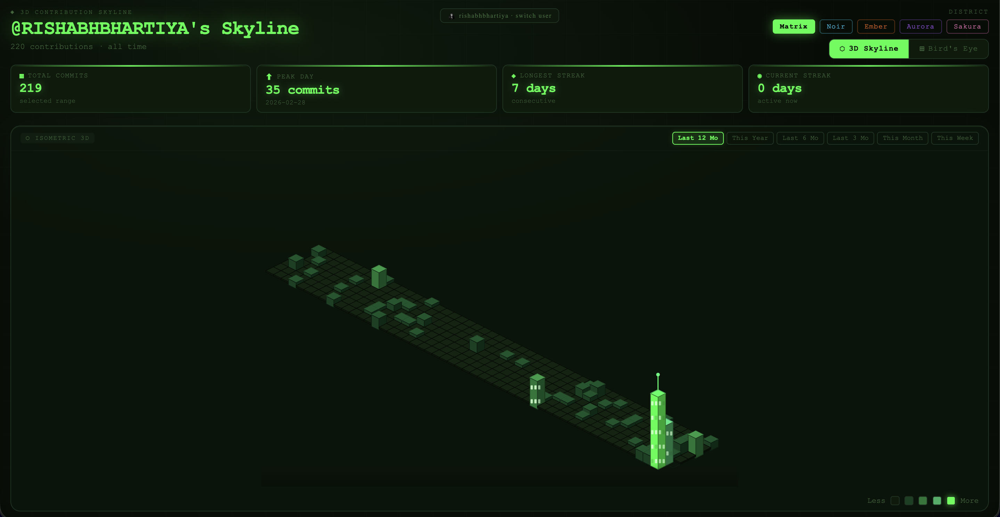
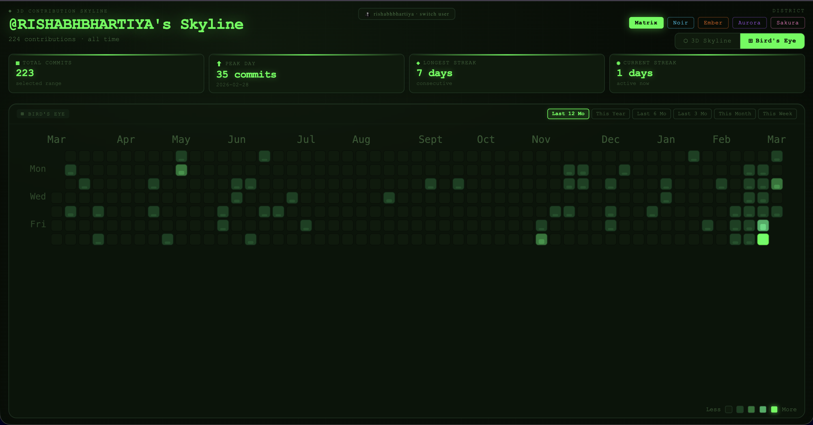
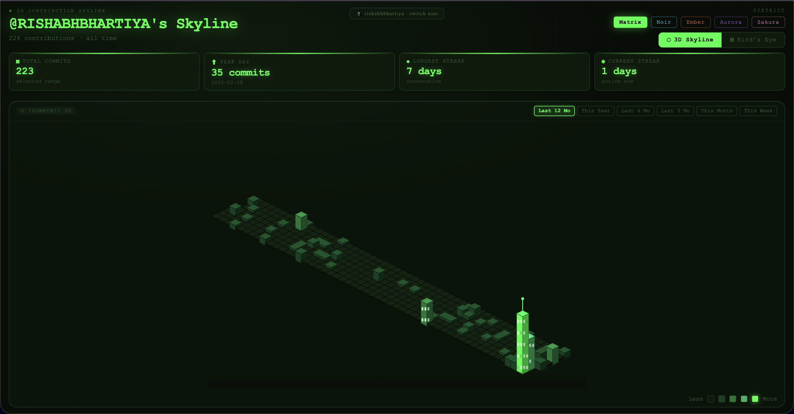
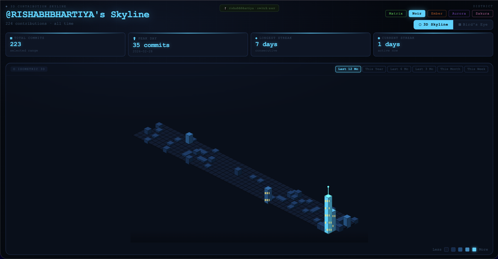
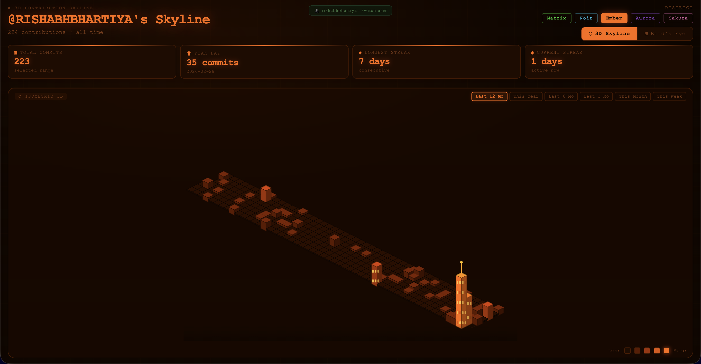
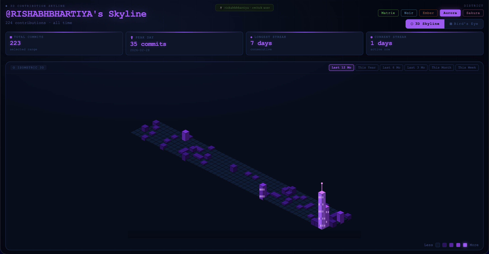
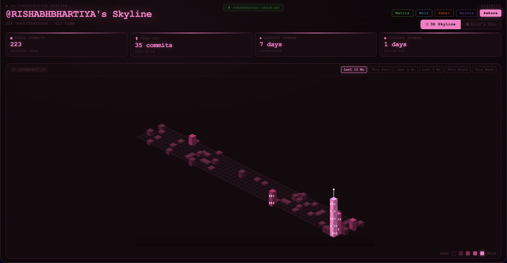
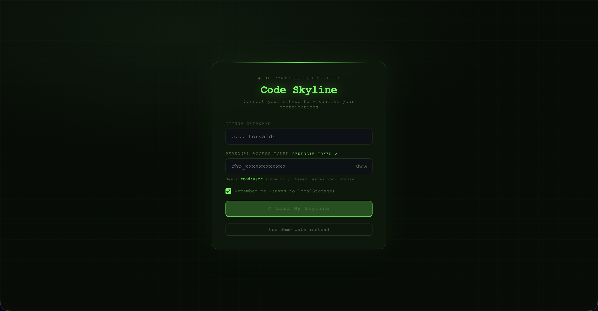
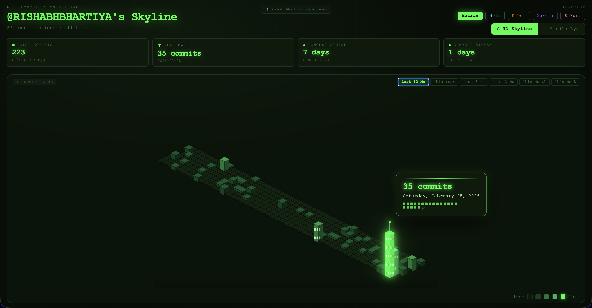

# GitContra

**Your GitHub contribution history — reimagined as a 3D city skyline**




[🌐 Live Demo]([https://your-skyline.vercel.app](https://git-contra.vercel.app/)) · [Quick Start](#quick-start) · [Embed](#embed-on-your-portfolio) · [Themes](#themes)

---

## What is GitContra?

GitContra transforms your GitHub contribution graph into an interactive isometric 3D city skyline. Every day you commit code, a building grows. The more contributions, the taller the tower.

Built entirely with React and SVG — no Canvas, no WebGL, no heavy dependencies.



---

## Features

- **⬡ Isometric 3D Skyline** — dimetric projection, proportional building heights, windows, antennas
- **⊞ Bird's Eye View** — classic GitHub-style heatmap toggle
- **🎨 5 Themes** — Matrix, Noir, Ember, Aurora, Sakura
- **📅 Time Filters** — Last 12 Mo, This Year, Last 6 Mo, Last 3 Mo, This Month, This Week
- **📊 Live Stats** — total commits, peak day, longest streak, current streak
- **🔗 URL Params** — shareable links with username, token and theme pre-loaded
- **💾 Remember Me** — credentials saved to localStorage, auto-loads on return
- **📱 Responsive** — fits any viewport, no scrolling needed
- **🚫 Zero extra dependencies** — only React 18 + Vite

---

## Screenshots

> Add your own screenshots by creating a `screenshots/` folder in the repo root and saving images with the filenames below.

| Matrix Theme | Noir Theme |
|---|---|
|  |  |

| Ember Theme | Aurora Theme | Sakura Theme |
|---|---|---|
|  |  |  |

| Login Screen | Stats Bar |
|---|---|
|  |  |

---

## Quick Start

### Prerequisites

- Node.js 18+
- npm or yarn
- A GitHub Personal Access Token — [how to get one](#github-token)

### Run Locally

```bash
# 1. Clone the repo
git clone https://github.com/yourname/gitcontra.git
cd gitcontra

# 2. Install dependencies
npm install

# 3. Start the dev server
npm run dev

# 4. Open in your browser at http://localhost:5173
```

Enter your GitHub username and token on the login screen. Tick **Remember me** and you will never need to enter it again.

---

## GitHub Token

GitContra needs a Personal Access Token with `read:user` scope only. It cannot write, delete, or modify anything on your account.

**Steps:**

1. Go to [github.com/settings/tokens/new](https://github.com/settings/tokens/new?scopes=read:user&description=GitContra)
2. Name it `GitContra`
3. Tick only `read:user`
4. Click **Generate token**
5. Copy the `ghp_xxxxxxxxxxxx` value — you only see it once

Your token goes directly from your browser to `api.github.com`. It is never sent to any third-party server. If you use Remember me, it is stored only in your own browser's localStorage.

---

## Embed on Your Portfolio

### Option 1 — URL Link

Share or bookmark a pre-loaded skyline:

```
https://your-skyline.vercel.app/?username=YOUR_USERNAME&token=YOUR_TOKEN&theme=noir
```

URL Parameters:

| Parameter | Required | Description | Example |
|-----------|----------|-------------|---------|
| `username` | Yes | GitHub username | `torvalds` |
| `token` | Yes | Personal access token with `read:user` | `ghp_xxx` |
| `theme` | No | Initial colour theme | `noir` |

---

### Option 2 — iframe Embed

Drop this into any HTML page to embed your live skyline:

```html
<iframe
  src="https://your-skyline.vercel.app/?username=YOUR_USERNAME&token=YOUR_TOKEN&theme=noir"
  width="100%"
  height="500px"
  frameborder="0"
  style="border-radius: 12px; overflow: hidden;"
  title="GitContra — My Contribution Skyline"
></iframe>
```

Tips:
- Use `height="480px"` for a compact single-viewport embed
- Add `border-radius: 12px` to match your site's card style
- Use `theme=` to match your portfolio's colour scheme
- The iframe is fully interactive — hover tooltips, theme switching, and view toggle all work inside it

---

### Option 3 — React Component

Copy these folders into your existing React project:

```
src/components/ContributionGraph3D/
src/hooks/
src/constants/
src/utils/
```

Then import and use:

```jsx
import { ContributionGraph3D } from "./components/ContributionGraph3D";

// With your own data
<ContributionGraph3D
  contributions={data}
  themeName="noir"
  title="My Skyline"
/>

// With random demo data
<ContributionGraph3D
  contributions={null}
  themeName="matrix"
  title="Code Skyline"
/>
```

The `contributions` prop accepts an array of `{ date: "YYYY-MM-DD", count: number }` objects. Pass `null` to use randomly generated demo data.

---

## Deploy Your Own Instance

### Vercel (Recommended)

```bash
npm i -g vercel
vercel
```

Or via the dashboard:

1. Push this repo to GitHub
2. Go to [vercel.com](https://vercel.com) → New Project → Import your repo
3. Framework preset: Vite (auto-detected)
4. Build command: `npm run build`
5. Output directory: `dist`
6. Click Deploy

### Netlify

1. Go to [netlify.com](https://netlify.com) → Add new site → Import from Git
2. Connect your repo
3. Build command: `npm run build`
4. Publish directory: `dist`
5. Deploy

### Any Static Host (GitHub Pages, S3, etc.)

```bash
npm run build
# Upload the contents of /dist to your host
```

---

## Themes

| Name | Accent | Vibe |
|------|--------|------|
| `matrix` | `#00ff41` | Classic terminal green |
| `noir` | `#00d4ff` | Dark cyberpunk cyan |
| `ember` | `#ff6b35` | Warm fire orange |
| `aurora` | `#a855f7` | Northern lights purple |
| `sakura` | `#f472b6` | Cherry blossom pink |

Switch themes using the buttons in the top-right of the app, or pass `?theme=noir` in the URL.

---

## Time Filters

| Filter | Range |
|--------|-------|
| Last 12 Mo | Rolling 12 months from today |
| This Year | January 1st to today |
| Last 6 Mo | Rolling 6 months |
| Last 3 Mo | Rolling 3 months |
| This Month | First of current month to today |
| This Week | Sunday of current week to today |

All stats cards recalculate for the active filter.

---

## Project Structure

```
gitcontra/
├── public/
├── screenshots/                        ← add your screenshots here
└── src/
    ├── App.jsx                         ← auth flow, URL params, localStorage
    ├── components/
    │   └── ContributionGraph3D/
    │       ├── ContributionGraph3D.jsx ← root graph component
    │       ├── GitHubConnect.jsx       ← login screen
    │       ├── IsometricGrid.jsx       ← 3D SVG grid
    │       ├── Building.jsx            ← single day building
    │       ├── BirdsEyeGrid.jsx        ← heatmap view
    │       ├── StatsBar.jsx
    │       ├── Tooltip.jsx
    │       ├── ThemePicker.jsx
    │       ├── ViewToggle.jsx
    │       └── GraphLegend.jsx
    ├── hooks/
    │   ├── useGitHubData.js            ← GitHub GraphQL API fetch
    │   ├── useContributionData.js
    │   ├── useMountAnimation.js
    │   └── useMousePosition.js
    ├── constants/
    │   ├── graph.js
    │   └── themes.js
    └── utils/
        ├── dataUtils.js
        └── colorUtils.js
```

---

## Tech Stack

| Technology | Purpose |
|------------|---------|
| React 18 | UI components and state |
| Vite 5 | Build tool and dev server |
| SVG | All rendering — no Canvas, no WebGL |
| GitHub GraphQL API | Live contribution data |

---

## License

MIT — use it, fork it, embed it, build on it freely.

---

## Contributing

Pull requests are welcome. For large changes please open an issue first to discuss what you would like to change.

---

Made with lots of coffee and too many commits

[⬡ Try GitContra Live](https://git-contra.vercel.app/)

If this helped you, consider starring the repo ⭐
